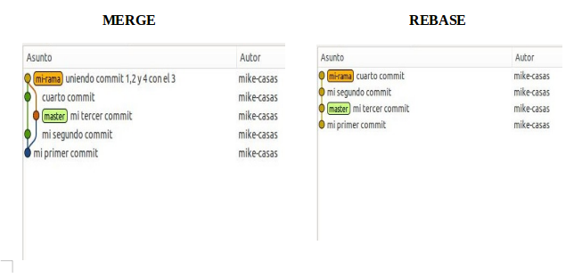

# taller-git

## 1. Conceptos básicos
       man git 
para el manual completo    

        man git-orden     
       
Para iniciar repositorio con branch principal que se llama main
    
        git init -b main

El estado de tu respositorio

        git status

Pueden ser untracked que nos los reconoce y unstanged

* Untracked: Archivos que no están añadidos al repositorio. Para ello lo añades y lo commiteas

        git add
        git commit

    Cuando haces eso para a staged, para volver a unstanged. git restore 

Para subir los cambios a ese repositorio sería con git commit -m "mensaje corto" -m "mensaje largo". 

Cuando haces varios commit se quedan varios ahi y para gestionarlos

    git log
    git whatchanged

Al hacer el log coges una cadena que pone al lado de commit, y haces

    git log id_comit

Para ver cambios al ultimo commit

    git diff    

Entre commit 
    git diff HEAD id_comit

Para hacer commit y add de archivos ya añadidos 

    git commit -am "texto"

## Local y remoto

Todo lo que trabajos ahora mismo es de forma LOCAL.

Inicias un repositorio como git init
y luego quiere subir ese repositorio a uno de github, haces 

    git remote add origin git@github:thejosess/nombre_repo_creadoEnGIthub

    git remote add <remoto> <direccion>

Y para ver remote

    git remote
    //mas info con man git-remote

Despues de hacer un remote hay que subirlo, es empujar al remoto.
Luego hay que decirle que a partir de ahora la rama será main

    git push --set-upstream origin main

## Github
insight es para ver las ramas de forma gráfica

## SSH y clonar
Al clonar con https de la pagina, no hace uso de SSH para cambiarlo

    git remote set-url origin git@github.com:name/repo

## Licencia desde GITHUB
LICENCE 
add new file, LICENCIE y mirar templaye y pones GPL2

## Git Pull
Para bajar lo que hay en el repo remoto y añadir ese al local

    git pull

pull rebase -> 
pull merge -> la opción por defecto

me sale esto -> HEAD -> main, origin/main, origin/HEAD
porque hemos añadido la rama main al origin (el de github). Y al decirle upstream entonces la rama "princpial" es esa.
upstream -> subo los cambios cuando no le pongo argumento.
Main es la rama principal de Origin y tambien la principal de local.
Al resto tienes que pasarlo al resto.

git push origin main
//esto le dices que suba lo que tienes en rama main local que lo suba a origin de main, lo hace por defecto al llamarlo upstream. 
Ver ramas con 

    git branch

    git branch -r
    //ramas remotas

Con todo esto que signifca al ejecutar git branch -r así
  origin/HEAD -> origin/main
  origin/main

//descargar archivo .sh para cuando quieres añadirle algo al repo

## Conflictos de repo
git status
abres el archivo concreto y te salen ahí las lineas
y comando que te pide

eliges con que quedarte

<<<<<< head
<<<<< commit

## Git restore

Restore te permite eliminar archivos añadidos por git add

    git restore --staged

Y tambien descartar cambios locales en archivos mediante el ultimo commit estable.

    git restore

## Git reset

Regreaar a un punto/commit especifico debil

    git reset --soft id_commit

Duro

    git reset --hard id_commit

volver al ultimo commit

    git reset --soft HEAD^

## Git checkout

Como forma de recuperar cambios

    git checkout .

Deshacer todos los cambios de un archivo

    git checkout -- nombreArchivo

## Ramas

Separar ramas para hacer testeo, experimientación, etc. Rama main es estable y el resto para esas nuevas funcionales que están desarrollando inestables.

Ver las ramas de nuestro repo

    git branch

Crear una branch

    git branch nombre_rama_nueva

Cambiar de rama 

    git checkout nombre_rama

mezclar ramas y deja el gráfico de las ramas

    git merge nombre_rama

 
Primero te vas a la rama master y luego unes con la rama
    
    git checkout master
    git merge rama_distinta

creamos y hacemos un checkout en una rama llamada nombre_rama y haces como arriba

    git checkout -b nombre_rama

mezclar ramas rompiendo el esquema

    git rebase nombre_rama

Que es git fetch? Trae los cambios pero los deja en otra rama
    
    git pull = git fetch + git merge FETCH_HEAD

## Test y taller curso-TDD

Para crear issues tienes que crear historias de usuario y entonces la issue se encarga de que se cumple una historia de usuario.  
Parar crear issue vas en github y pones issue, crear issue y la rellenas segun una  [plantilla qa](https://jj.github.io/curso-tdd/).  Las issues se agrupan en milestones (seleccionas en github varias y le das a milestone).     

Los errores y manejar excepciones se crean de forman paralelea y vienen por la necesidad de las HU.    Diseño dirigido por dominio ("se deben de crear modelos de partes del dominio del problema limitados en su contexto, de forma que sea sencillo dividir el proceso de implementación en equipos, cada uno de ellos responsables de una parte del diseño. La integración continua (y los tests correspondientes), permitirán que se asegure la calidad del producto resultante")    

La integración continua es a un primer nivel, la integración continua consiste en incluir en la rama principal los cambios hechos por un miembro del equipo en el momento que estén hechos y pasen los.
 
Cada vez que avances en un hito avanzas en el primer numero de la versión, si falla un test y lo arreglas sería v.0.0.1 -> v0.0.2, si es muy gorde v.0.1.0  
Sería 
    
    git tag -a v0.0.1 -m "texto"

añades tag al push

    git push --tags

Para cerrar una issue seŕia

    git commit -am "texto close #2"

#2 Es el id de la issue.

Para incorporar un cambio a un repositorio que no es nuestro en el que hemos trabajdo, primero

    git fork

y luego

    git pull request

El archivo qa.json explica el lenguaje, la forma de construcción, donde está el código y el archivo de test para información de los test automáticos.

        {
        "lenguaje":" ",
        "build":" ",
        "clase":" ",
        "test" : " "
        }

El archivo META6.json se centra en las depedencias, versión del lenguaje, etc.

    {
  "name": "IncidenciasTrafico",
  "version": "0.1",
  "perl": "6.*",
  "depends": [
    "sake",
    "JSON::Fast"
  ],
  "resources": [ "data.json"],
  "build-depends": [],
  "test-depends": [],
    "provides": {
	"IncidenciasTrafico::JSON"     : "lib/IncidenciasTrafico/JSON.pm6",
	"IncidenciasTrafico::Dator"          : "lib/IncidenciasTrafico/Dator.pm6",
	"IncidenciasTrafico::Stored"         : "lib/IncidenciasTrafico/Stored.pm6",
	"IncidenciasTrafico::NoTipo"      : "lib/IncidenciasTrafico/NoTipo.pm6",
	"IncidenciasTrafico::Incidencia"          : "lib/IncidenciasTrafico/Incidencia.pm6",
	"IncidenciasTrafico::Zona"      : "lib/IncidenciasTrafico/Zona.pm6"
  }
}

Es necesario tambien hacer test internos de nuestro código, test de forma automática en la nube (travis), smoke test, test unitarios, etc. Mirar todo el mundo de tests. Tambien se pueden acelerar estos tests con docker (una carpeta para los archivos de tests). Y para lanzar travis hay que aceptarlo en github y luego crear un archivo

    travis.yml

Con contenido variable (ejemplo taller)

    language:
    - minimal

    services:
    - docker

    install:
    - docker pull jjmerelo/raku-test
    - docker images

script:  docker run -v  $TRAVIS_BUILD_DIR:/test jjmerelo/raku-test

**Para más información**

[curso TDD](https://github.com/JJ/curso-tdd)

[Trabajo microservicios](https://github.com/thejosess/microservicios/blob/main/README.md)
